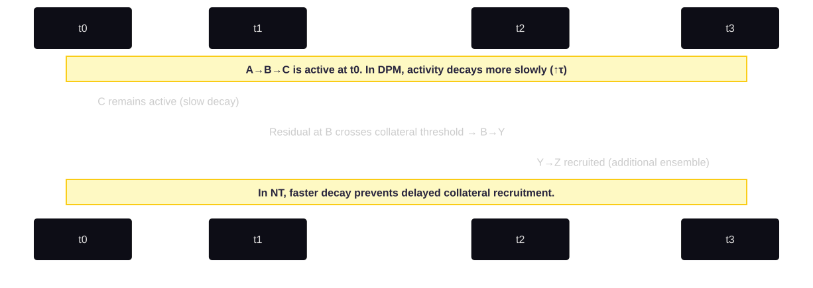

# The Higher-Resolution Hypothesis: A Distributed Pathway Model of Autism

Thiago Sindra

Independent Researcher

September 2026

## Abstract

<!-- REVISED: less-authoritative pass -->
Autism presents a paradox: exceptional perceptual detail and pattern sensitivity sit alongside sensory overload, difficulty generalizing, and difficulty switching. This document describes an idea I have been working on to make sense of that paradox in my own experience and in the literature I have read. I call it the **Higher-Resolution Hypothesis (HRH)**, and I describe one possible mechanism for it, the **Distributed Pathway Model (DPM)**.

My working guess is that autistic cortex makes more *routes* available for the same input — not more neurons per signal so much as more possible combinations of ensembles that can represent it, because collateral connections that would normally be pruned or tightly gated remain available and open under stronger or more sustained input. If that is true, the same stimulus would be represented with finer granularity, which is what "higher resolution" feels like from the inside.

The same architecture would carry two costs. First, the extra routes need to be gated, and I suspect gating is both stronger in some respects and less precise in others, which would reduce flexible integration across domains. Second, running more routes at once costs more energy in the same patch of tissue, which could starve neighboring circuits and, because inhibitory neurons draw from the same pool, could weaken gating exactly when it is most needed. I think this pairing might account for the familiar progression from focused competence to overload and collapse, but I have not been able to show it.

I do not know how large any of these effects would be, whether they are measurable with current methods, or how to distinguish this account from existing excitation/inhibition-balance and predictive-coding models with which it shares most of its predictions. I am publishing it as a hypothesis I cannot currently test, in the hope that people with the right tools can tell me where it is wrong.

**Keywords:** autism spectrum, distributed connectivity, higher-resolution processing, excitation/inhibition balance, energy competition, metabolic constraints, predictive coding, sensory integration, neurodevelopment, neural branching, heterogeneity.

---

## Introduction

<!-- REVISED: less-authoritative pass -->
Autism, as I understand it, is not a collection of behavioral traits or social deficits. My sense is that it reflects a different mode of neural organization, and in this document I try to describe what I think that mode might be. The idea at the center of it is that the autistic brain encodes and processes information at a higher level of granularity — a difference I call the **Higher-Resolution Hypothesis**.

<!-- REVISED: less-authoritative pass -->
By higher resolution I mean something like this: perception, cognition, and internal states seem to be composed of more micro-signals per unit of experience. Autistic individuals may perceive and represent more of the world at once—more nuance, more detail, more overlapping meaning—but this comes with a cost: increased computational demand, energetic load, and susceptibility to overload or runaway activation.

<!-- REVISED: less-authoritative pass -->
I do not mean "higher resolution" as a metaphor. I suspect it reflects real differences in how cortical and subcortical circuits are wired and gated, though I cannot point to a measurement that establishes this. The mechanism I have in mind is what I call the **Distributed Pathway Model (DPM)** — a sketch of how a neuron's local structure and a circuit's branching behavior could produce richer but less filtered propagation of activity.

---

## Acknowledgment of Lived Experience Integration

Although this document is written in scientific language, much of its insight originates from lived experience—direct observation of my own cognitive and sensory processes and comparison with empirical research. I have sought to interpret subjective patterns through an objective lens, aligning phenomenology with neuroscience rather than privileging one over the other. This hypothesis therefore represents both a **personal investigation** and a **scientific proposition**: an attempt to model from within what is typically only measured from without.

---

## The Distributed Pathway Model (DPM)

### Overview

<!-- REVISED: less-authoritative pass -->
All cortex is recurrent and divergent; no brain runs on clean linear chains. What differs, I suspect, is how tightly the alternative routes are gated. In typical development, pruning removes many collateral branches and inhibition closes most of the rest, so that under ordinary input each processing stream stays largely within its own channel. The result is a network that is comparatively streamlined, energy-efficient, and selective.

In the autistic brain, my reading of the literature is that this balance may be shifted. Branching during development is more extensive, and pruning only partially accounts for the resulting density. Evidence also suggests ongoing collateral formation and atypical stabilization of new synapses throughout life, extending distributed propagation beyond early development. Additionally, inhibitory gating is weaker or slower to mature. The result is an architecture where signals meant for one processing stream can bleed into functionally distinct networks—what I call **cross-network spillover**.

To illustrate this architecture, consider two independent neural circuits: **A → B → C** and **X → Y → Z**, which in neurotypical brains operate in isolation—each input (A or X) triggers only its corresponding output (C or Z). In autistic neural topology, neuron **B** may also project to **Y**, creating a cross-network connection. Now activation of **A** can produce **C** (within its original network), **Y → Z** (spillover into the second network), or both, depending on timing and inhibitory tone. This is the picture I have in mind when I talk about signals bleeding across streams.

<div style="text-align:center; margin: 2rem 0;">
  
  <p style="margin-top: 1rem;"><em><!-- NEW: Overview diagram (Batch 4) -->
<strong>Figure 0. DPM overview with conditional cross-route.</strong> The B→Y collateral is **gated**, creating *potential* cross-activation. Whether it participates depends on input conditions (strength, synchrony, context), matching the **conditional pathway** logic in the Core Mechanism.</em></p>
</div>

This is not merely "hyperconnectivity." It is a qualitative difference in **branching topology**—a more distributed network where neurons participate in multiple, sometimes overlapping, pathways *across functional boundaries*. This architecture naturally increases representational richness: the same stimulus engages a larger and more diverse population of neurons spanning multiple processing systems. However, it also introduces instability, as these distributed activations cross boundaries between networks that should remain isolated.

<div style="text-align:center; margin: 2rem 0;">
  
  <p style="margin-top: 1rem;"><em><!-- UPDATED: NT vs DPM figure caption (Batch 4) -->
<strong>Figure 1. Neurotypical vs Distributed Pathway processing (ensembles).</strong>
Nodes (A–Z) denote **ensembles**. Solid blue/green edges show stable within-network routes; dashed red edges are **conditional collaterals** that can activate depending on input strength/phase/context. In DPM, these latent routes expand **ensemble permutations**, increasing perceptual granularity without implying constant cross-activation.</em></p>
</div>

### Mechanistic Summary

The DPM describes three interdependent properties of autistic neural organization:

1. **Increased local branching** — greater axonal and dendritic divergence, producing multiple downstream targets for single neurons.
2. **Distributed propagation** — signal flow that engages several parallel microcircuits instead of a single chain.
3. **Variable inhibition** — reduced or delayed inhibitory control that allows overlapping activations to persist or echo.

Together, these yield higher representational density but also greater temporal variability, energetic cost, and sensitivity to interference.

#### Core Mechanism

<!-- UPDATED: DPM Core Mechanism opening -->
The Distributed Pathway Model (DPM) proposes that in autism, local circuits possess slightly weaker inhibitory gating (↓ I) and longer temporal persistence (↑ τ), allowing more **conditional pathways** to remain available for activation.  Each pathway consists not of isolated neurons but of **ensembles**—transient coalitions of neurons that jointly represent a perceptual or cognitive micro-feature.  The distinguishing property of the DPM is therefore not simply that more neurons respond to a given input, but that the same input can recruit **different overlapping ensembles** depending on signal strength, phase, and context.  This increases representational diversity without requiring continual hyper-activation.

<!-- NEW: DPM gating analogy -->
In this architecture, gating functions much like a **dike in a branching river**: low-energy inputs remain confined to the primary channel, while stronger or prolonged signals can overflow into neighboring routes.  These latent collaterals—normally pruned or inhibited in neurotypical development—introduce *potential* cross-activation without guaranteeing it.  Consequently, a single upstream event can propagate along slightly different trajectories on different occasions, yielding fine-grained discrimination of similar stimuli through variation in ensemble recruitment.

<!-- NEW subsection: Mechanistic Example -->
#### Mechanistic Example: Conditional Pathway Activation

To illustrate the role of gating and ensemble overlap, consider a simplified chain:

```
→ |Input| A
A → B
B → |Synapse 1| C
B → |Synapse 2| Y   *(present only in DPM networks)*
Y → Z
```

Here the "Input" represents any upstream activation — sensory, mnemonic, or predictive.
In neurotypical (NT) networks, *Synapse 2* (B→Y) is absent, so increasing input strength merely amplifies the existing A→B→C ensemble.
In the DPM, *Synapse 2* exists but is **gated**, so its participation depends on input intensity and context:

| Input Level | NT Activation | DPM Activation | Ensembles Formed |
|--------------|---------------|----------------|------------------|
| Low | A subthreshold | A subthreshold | — |
| Medium | A→B→C | A→B→C ( B→Y gated off ) | *C* |
| High | A→B→C | A→B→C  +  B→Y→Z | *C + Z (overlapping)* |

<div style="text-align:center; margin: 2rem 0;">
  
  <p style="margin-top: 1rem;"><em><!-- NEW: Mechanistic example figure (Batch 4) -->
<strong>Figure 1a. Mechanistic example with a gated collateral.</strong> Low/medium inputs recruit A→B→C; high inputs can push the **B→Y** gate open, recruiting Y→Z as an additional ensemble. Resolution emerges from **ensemble permutations**, not raw neuron count.</em></p>
</div>

<div style="text-align:center; margin: 2rem 0;">
  
  <p style="margin-top: 1rem;"><em><!-- NEW: Input strength cases figure (Batch 4) -->
<strong>Figure 1b. Input strength modulates ensemble recruitment.</strong> NT remains on a single route (C). DPM adds a **conditional route** (Y→Z) at high inputs, yielding *C* and *Z* ensembles with **overlap**, i.e., a larger **permutation space**.</em></p>
</div>

Because the DPM configuration allows multiple potential routes, the same region B can participate in **different ensemble combinations** depending on excitation level.  Resolution therefore arises from the *number of ensemble permutations* available, not merely the population size of active neurons.

### Branching and Conditional Routing

Branching introduces both spatial and temporal flexibility. A neuron such as **B** may project to **C** (within its own network) and **Y** (in a functionally distinct network). Depending on membrane potential, local field effects, or inhibitory gating, it may activate one route, both, or oscillate between them. This context-dependent routing provides adaptive potential—it can represent subtle variations in input—but it also produces unpredictability and internal noise.

This cross-network connectivity helps explain autism's multi-domain presentation: spillover between networks that should remain isolated means that activation in one functional system (e.g., visual processing) can inadvertently recruit circuits in another (e.g., emotional processing, motor planning, or auditory encoding). This is not merely increased activity within a single stream—it is *interference between independent processing channels*.

This may explain the intense perceptual richness and variability in autistic experience: multiple microcircuits partially engaged in parallel, encoding the same event from different angles, frequencies, or associative contexts—often spanning functional domains that would remain separate in neurotypical processing.

### Network Cascade Susceptibility and Seizure-Like Activity

*Note: This section discusses elevated susceptibility to seizure-like neural events based on architectural mechanisms. This is theoretical mechanistic discussion, not clinical guidance. Seizure evaluation and management require medical expertise and are outside the scope of this paper.*

Because each neuron is connected to more branches, each spike recruits a larger set of followers. When inhibition is strong and well-timed, this increases information flow without runaway activity. When inhibition is weak or asynchronous—as seen in many autism-linked genetic disruptions—the result is positive feedback and uncontrolled propagation.

Autism and epilepsy co-occur more often than chance, and there are many candidate explanations for that. If the DPM is right it would be one contributing factor: the same architecture that enhances resolution would also predispose the brain to excitatory cascades: one neuron activates two, two activate four, and so on, leading to reverberating waves of excitation.

**Energy depletion exacerbates this susceptibility.** As distributed activation depletes local ATP reserves, inhibitory interneurons—which require sustained energy to maintain ionic gradients and high-frequency firing—weaken in their suppressive efficacy. This creates a critical vulnerability window: the same branching architecture that recruited more neurons now faces diminished inhibitory containment, widening the temporal window during which cascades can propagate. Under conditions of sustained load or metabolic stress, this can produce **runaway spread**—brief paroxysmal events ranging from subclinical hypersynchronous bursts to clinically diagnosable seizure activity in susceptible individuals. This is not determinism but elevated architectural susceptibility contingent on the dual constraint of branching factor and energetic state.

At a systems level, this is also how I would account for why stress, fatigue, or sensory saturation can trigger overload or shutdown: too many distributed pathways activate simultaneously, consuming metabolic resources and collapsing coherence. The energy → inhibition weakening → cascade spread chain links informational overload to biophysical instability.

### From Micro to Macro

At the micro level, DPM describes changes in dendritic arborization, axonal collateralization, and interneuron recruitment. At the meso level, it would predict increased local functional connectivity and reduced long-range coordination — a pattern that several fMRI and MEG studies have reported, though not one that is specific to this model. At the macro level, it manifests as cognitive features: extraordinary perceptual detail, difficulty filtering noise, associative depth, and vulnerability to overload.

<!-- NEW: permutation principle addition -->
This relationship can be restated as a **permutation principle**: what appears as high resolution or nuanced sensitivity at the behavioral level reflects the brain's ability to select among a larger set of partially overlapping ensembles.  Each percept or idea corresponds to one configuration within that space.  The expansion of possible configurations increases discrimination capacity but also metabolic cost, as maintaining and resolving these overlapping patterns demands additional energy and inhibitory control.

Thus, DPM is not a pathology model but a topology model: it describes how information flows differently in the autistic brain, resulting in both abilities and challenges.

---

## Mechanistic Deep Dive: The Distributed Pathway Model in Action

<!-- REVISED: less-authoritative pass -->
This section is where I try to say concretely what the DPM would mean at the circuit level. I want to be clear about its status: none of what follows is measured, modeled, or fitted. It is my attempt to name the moving parts so that someone who *can* measure them knows what I am pointing at. Earlier drafts of this section carried illustrative numbers and equations; I have removed them because they gave the text a precision it never had.

### 1. Four things that would have to be different

<!-- REVISED: less-authoritative pass -->
If the DPM is right, I think four properties of a microcircuit would differ from typical, and everything else in this document is downstream of them:

- **Branching (B)** — how many downstream targets a neuron effectively reaches, via axonal collaterals and dendritic arborization. I imagine this is higher.
- **Inhibitory gating (I)** — how strongly and, especially, how *precisely in time* inhibition closes off alternative routes. I imagine this is less precise, though as I discuss later I am not sure whether it is weaker overall or stronger in some places and weaker in others.
- **Persistence (τ)** — how long activity reverberates locally after the input stops. I imagine this is longer.
- **Energetic cost (E)** — the metabolic price of running more routes for longer. I assume this rises with branching and persistence and falls with gating, but I have no basis for saying how steeply.

I use these four letters throughout as shorthand for "the thing that would have to be different," not as parameters of a model. I do not know their typical values, their autistic values, or whether they can be measured independently of one another in a living human.

<div style="text-align:center; margin: 2rem 0;">
  
  <p style="margin-top: 1rem;"><em><!-- UPDATED: Parameters figure caption (Batch 4) -->
<!-- REVISED: less-authoritative pass -->
<strong>Figure 2. The four moving parts.</strong> In the DPM, more branching, less precise gating, and longer persistence would enlarge the space of ensemble combinations (**P**) at a metabolic cost (**E**). No values are implied.</em></p>
</div>

### 2. Active and Reactive Pathways

The DPM distinguishes between two proposed classes of pathway activation:

- **Active pathways** are those directly driven by external input or task demands (the intended signal flow).
- **Reactive pathways** are collateral activations that emerge when excitatory propagation exceeds inhibitory containment (spillover recruitment).

<!-- REVISED: less-authoritative pass -->
I find it useful to think about the *balance* between these two — how much of what happens in a circuit is on-path versus spillover. I would expect that balance to sit further toward the reactive side in autistic cortex, and to differ from person to person and from domain to domain within the same person, which is one way I make sense of "spiky" ability profiles. I have no idea what the ratio actually is in anyone.

### 3. Circuit Walkthrough: Hypothetical Sensory Encoding Example

<!-- REVISED: less-authoritative pass -->
To make this concrete, consider a simplified picture of edge detection in **primary visual cortex (V1)**. This is a thought experiment about what the difference might look like in one concrete circuit. Nothing here is measured.

**Typical processing:**
> Photoreceptor → LGN relay → V1 layer 4 simple cells → layer 2/3 complex cells → V2  
> (*A* → *B* → *C*)

Fast feedforward inhibition suppresses non-vertical-tuned neighbors. The edge signal propagates cleanly to V2 with minimal cross-talk to color or motion pathways.

**Distributed processing (what I imagine instead):**
> *A* → *B* → *C* (within-network: primary edge detection pathway)
> *A* → *B* → *Y* → *Z* (cross-network spillover: B projects to Y in color/motion network)

Less precise inhibition allows spillover across functional boundaries. The cross-network connection (*B* → *Y*) means edge detection in one network can now recruit color-processing or motion-sensitive circuits (*Y* → *Z*) from functionally distinct systems that should remain isolated. Reactive recruitment continues well beyond stimulus offset, engaging networks meant for different sensory dimensions and creating multi-domain activation from a single input.

<div style="text-align:center; margin: 2rem 0;">
  
  <p style="margin-top: 1rem;"><em><!-- UPDATED: Three pathways figure caption (Batch 4) -->
<strong>Figure 3. Extended conditional routes.</strong> Multiple **gated collaterals** (B→Y, X→N) expand the **ensemble permutation space**, enabling finer discrimination across similar inputs without implying constant cross-talk.</em></p>
</div>

<!-- REVISED: less-authoritative pass -->
**Predicted phenomenology:** If something like this happens, I would expect the edge to be experienced with additional texture granularity, possible color associations, and motion aftereffects—producing richer visual detail but at significant metabolic cost. This matches my own experience of why 'just seeing' can be tiring, though I recognize that is not evidence.

<div style="text-align:center; margin: 2rem 0;">
  
  <p style="margin-top: 1rem;"><em><!-- REVISED: less-authoritative pass -->
<strong>Figure 4. Distributed processing in V1 edge detection (thought experiment).</strong> Spillover from V1 simple cells could engage adjacent orientation columns and color- and motion-processing streams, producing richer detail at higher metabolic cost. No quantities are implied.</em></p>
</div>

### 4. Temporal Dynamics: Proposed Cascade Propagation

The distributed topology could create characteristic temporal signatures, testable through electrophysiology or calcium imaging:

**Feedforward phase:** Initial activation spreads through branching architecture. In NT circuits, inhibition gates this quickly. In DPM, weaker *I* might allow continued propagation into secondary branches.

**Reactive phase:** Spillover activity could reach reactive pathways. If these loop back onto active regions (recurrent connectivity), they might create local reverberation. The persistence constant τ would govern duration.

**Decay phase:** Inhibition eventually quenches reactive activity, but longer τ would mean substantial "tail" activation. New stimuli during this period might interact with lingering reactive signals, producing interference or facilitation.

<!-- REVISED: less-authoritative pass -->
**What I would look for:** if this is right, imaging of a local population responding to a simple stimulus would show a wider spread of activation, a longer tail, and possibly a second bump after the first response as spillover re-enters the active region. I do not know how large any of these would be, and each of them is also predicted by simpler E/I-imbalance accounts.

<div style="text-align:center; margin: 2rem 0;">
  
  <p style="margin-top: 1rem;"><em><!-- UPDATED: Temporal cascade figure caption (Batch 4) -->
<strong>Figure 5. Temporal persistence (τ) and delayed recruitment.</strong> Longer **τ** maintains residual activation so that **B→Y** can cross threshold slightly later, adding a second ensemble (Y→Z) without sustained external drive.</em></p>
</div>

### 5. Inhibitory Timing and Control Mechanisms

The DPM does not propose absence of inhibition—rather, it hypothesizes altered timing and recruitment patterns of specific interneuron subtypes. These are proposed as candidate mechanisms to be tested:

**Parvalbumin (PV) interneurons** provide fast feedforward inhibition. If PV recruitment were delayed or reduced in strength, this would widen the temporal window for branching propagation.

**Somatostatin (SST) interneurons** provide dendritic inhibition modulating input integration. Reduced SST function could permit more dendritic branches to reach spike threshold simultaneously, increasing *B*.

**VIP interneurons** disinhibit principal cells by suppressing SST interneurons. Altered VIP timing might paradoxically increase reactive spread by removing the brake on dendritic integration.

<!-- REVISED: less-authoritative pass -->
**How this might be probed:** Optogenetic manipulation in autism-linked organoid systems (SCN2A, POGZ, CHD8) could ask whether changing PV timing changes how far activity spreads, and whether changing SST dendritic inhibition changes how long it persists. I am not in a position to run these and I do not know whether existing organoid systems have the temporal resolution to answer them.

<div style="text-align:center; margin: 2rem 0;">
  
  <p style="margin-top: 1rem;"><em><!-- UPDATED: Inhibitory control figure caption (Batch 4) -->
<strong>Figure 6. Gating as a "dike."</strong> Low energy stays in the primary channel (A→B→C). With higher/longer input, the **gate (dike)** opens, allowing overflow into the collateral channel (B→Y→Z). This models **conditional** cross-activation in DPM.</em></p>
</div>

### 6. Energetic cost

<!-- REVISED: less-authoritative pass -->
The brain's energy budget is dominated by signaling — maintaining ionic gradients, firing, and synaptic transmission (Attwell & Laughlin 2001; Lennie 2003). Any architecture that recruits more neurons per input, keeps them active for longer, and runs more routes in parallel will cost more, and that cost is paid locally, in the tissue where the extra activity happens.

I do not know how much more. Earlier drafts of this section multiplied assumed branching factors and persistence times into multipliers on energy consumption; I have removed those because they were arithmetic on invented inputs.

What I would expect, qualitatively, is higher resting consumption in heavily used associative cortex, faster local depletion under sustained load, and more demand on glial support. Whether any of that is measurable at the spatial scale where I think it matters is discussed in section 8.

**One thing this framing does for me:** the exhaustion many autistic people report from apparently passive activities — being in a busy room, following a conversation — would be genuine metabolic depletion rather than a psychological failing. I cannot show that, but it is the reading I find most consistent with my own experience.

### 7. Synaptic-Level Mechanisms: Developmental Substrate

The distributed topology could arise through known developmental processes, which this model treats as candidate mechanisms rather than verified causes:

<!-- REVISED: less-authoritative pass -->
**Dendritic pruning:** Typical development removes a large fraction of initial dendritic branches by adolescence. If autism-linked variants (CHD8, ARID1B, PTEN) extend critical periods or raise the threshold for pruning, more branches would remain — which is one route to higher B. This is in principle measurable in post-mortem tissue or organoids, though I am not aware of a study that has framed it this way.

Importantly, the DPM does not attribute higher synaptic density solely to reduced pruning. Lifelong formation of collateral branches and atypical retention of newly formed synapses may further increase branching after the developmental pruning phase. This continual remodeling aligns with reports of heightened plasticity and extended critical-period dynamics in autism.

**Axonal collateralization:** If pyramidal neurons keep more stable collaterals than typical, each reaching a different downstream population, that would physically instantiate higher B.

**Spine density:** Some post-mortem work has reported higher spine density on pyramidal dendrites in parts of autistic cortex (e.g., Hutsler & Zhang 2010). If accurate, each additional spine represents a potential branch point for signal integration, contributing to increased *B*.

Each of these has some support in the literature. None of it was gathered to test the DPM, and I do not know how to get from any of them to the claim that the resulting network behaves the way I describe.

### 8. What would change my mind, and what I don't know how to test

<!-- REVISED: less-authoritative pass -->
I am not a bench scientist and I do not have a clean experimental design for this hypothesis. What I can do is say what would make me more or less confident, and be honest about the parts I do not know how to test at all.

**Things that would make me more confident**

- Finding that autistic cortex retains more collateral branching than typical, *and* that those collaterals are functionally gated rather than simply present.
- Local recordings showing wider spatial recruitment, longer persistence, and delayed inhibitory rebound in response to simple stimuli.
- Evidence that inhibitory precision degrades with local energy depletion faster in autistic tissue than in typical tissue.
- Metabolic imaging showing faster local depletion under sustained load in the regions doing the work.

**Things that would make me less confident**

- Finding that branching and spine density in autistic cortex are typical once you control for region and age.
- Finding that spatial spread of activation is typical and that autistic sensory differences are fully explained by gain or precision-weighting changes at the level of a single stream.
- Finding that autistic overload states show no local metabolic signature distinct from ordinary fatigue.

**Things I don't know how to test**

- **Branching in living humans.** B is a property of individual neurons. Post-mortem tissue and organoids can measure it, but neither can tell you what the same brain's cognition was like.
- **"Same information, more routes."** The hypothesis compares how two brains represent *equivalent* input. I do not know how to establish that two brains are processing equivalent information, which is a prerequisite for any comparison of how much machinery they use to do it.
- **Energy competition at the scale I claim it matters.** I have argued that the constraint operates at the level of cortical columns over hundreds of milliseconds to seconds. No current method measures ATP availability at that spatial and temporal resolution during a task. FDG-PET and MRS operate at much coarser scales; they might show something, but they cannot confirm the mechanism as I have stated it.
- **Distinguishing the DPM from E/I imbalance.** Most of what I would look for — wider spread, delayed inhibition, higher spine density — is also predicted by the much simpler claim that excitation/inhibition balance is shifted. I do not currently have a prediction that separates the two. The closest I can get is that the DPM predicts spillover should be *conditional* — present under strong or sustained input and absent under weak input — whereas a global E/I shift would show up at all input levels. I do not know whether that difference is measurable.
- **Anything about subjective resolution.** The name of the hypothesis refers to an experience. I have no idea how to measure it in a way that would let two people be compared.

I would rather state these gaps than paper over them with a list of experiments I have no way to run.

### 9. Integration with Established Phenomenological Patterns

If something like the above is going on, here is how I would read several patterns described elsewhere in this document:

**Stimming as reactive motor cascade:** Reactive spillover from distributed propagation into motor circuits can produce patterned movement. This document does not model such movements as regulatory or stabilizing—only as architectural outputs of cross-domain propagation.

**Memory encoding differences:** Denser representation during initial encoding would store more microstates per episodic event, potentially producing richer recall but also more interference between similar memories. Elevated τ could explain why memories loop or intrude—reactive reentry keeps reactivating stored patterns.

**Interoceptive intensity:** If visceral signals propagate through distributed brainstem-cortical pathways, recruiting broader insular and cingulate territories, and if low *I* amplifies this spread, this would explain amplified interoceptive awareness. Combined with low *I*, internal states (hunger, pain, emotion) could dominate consciousness and trigger cascade activation.

**Special interests as predictive stability:** Repeated activation of the same domain could stabilize distributed branches through reinforcement, creating "islands of coherence" where prediction error is minimal. Mastery would reduce entropy in a high-τ, low-*I* system.

**Autonomic dysregulation:** If distributed propagation in autonomic circuits produces broad, sustained sympathetic or parasympathetic activation, and if elevated τ prevents quick resetting, this would explain prolonged stress responses and difficulty with transitions.

None of these is a finding. They are the readings that make the most sense to me if the architecture is as I describe.

### 10. Summary and Invitation

<!-- REVISED: less-authoritative pass -->
This section has tried to name the moving parts of the DPM concretely enough that someone could disagree with a specific one. I have deliberately removed the equations and worked numbers that earlier versions carried: they made the idea look more developed than it is.

What I am left with is a sketch — more branching, less precise gating, longer persistence, higher local cost — and a set of readings of autistic experience that follow from it if it is right. I do not know how to establish that it is right. If anyone reading this does, I would like to hear from them, and I would equally like to hear where it is wrong.

---

## Energetic Constraints on Parallel Processing

### The Metabolic Cost of Distributed Architecture

Neural computation is inherently energy-intensive, with the brain consuming approximately 20% of the body's metabolic resources despite comprising only 2% of body mass. This energy demand is not uniformly distributed: it scales directly with the number of active neurons, synaptic transmission frequency, and the spatial extent of engaged circuits. The DPM suggests that autistic cortex may run more overlapping routes for the same input than a typical brain does. This architectural difference creates a fundamental metabolic consequence: **distributed pathways consume proportionally more energy within localized cortical regions**.

Consider a simple sensory discrimination task. A streamlined pathway might engage N neurons within a cortical column to extract relevant features and suppress irrelevant ones. A distributed pathway performing the same task engages more neurons across overlapping circuits, each contributing partially redundant information that collectively achieves higher-resolution representation. While this architecture enables enhanced perceptual precision, it creates a localized energy demand that can exceed the metabolic capacity of the microregion—not because individual neurons are more expensive, but because **more neurons are simultaneously active in the same spatial domain**.

### Spatial Scales of Energy Competition

Neural energy metabolism operates across multiple spatial scales, but competition becomes critical at the level of **cortical columns**. These functional units share local capillary beds and ATP delivery systems, creating an "energy domain" within which neurons compete for limited metabolic resources. When distributed pathways span multiple overlapping columns, they create sustained high demand within these shared energy domains.

The critical insight is that energy competition occurs not at the whole-brain level (where total metabolic capacity is sufficient) but at the **microregional level** where local ATP delivery cannot keep pace with spike-driven demand. A cortical column can sustain baseline activity across all its neurons, but when a distributed pathway transiently hyperactivates more than the typical number of neurons within that column, local ATP stores deplete faster than capillary delivery can replenish them. This creates a **metabolic bottleneck window**—typically lasting hundreds of milliseconds to several seconds—during which other pathways competing for the same energy pool face insufficient resources to activate.

I want to flag that I am asserting a spatial scale here that I cannot measure. It is where the idea makes sense to me, not where I have seen it.

### Timescale Dynamics: ATP Buffering and Demand Spikes

The mismatch between metabolic and electrical timescales is, I think, the reason distributed pathways would create selective failures rather than uniform slowdown. ATP turnover operates on 1-10 second timescales, while neural firing occurs on 1-10 millisecond timescales. This mismatch creates vulnerability to **demand spikes**: brief periods (100-500 ms) of intense co-activation can transiently deplete local ATP faster than delivery mechanisms can compensate.

Neural tissue maintains ATP buffering capacity—a reserve pool that enables transient high-frequency firing without immediate metabolic collapse. However, this buffer is finite and regionally limited. When a distributed pathway engages, it draws heavily from this local buffer. If a second pathway attempts to activate in the same microregion during this depletion window, it encounters insufficient energy to cross activation threshold, despite receiving adequate input drive. The pathway fails to engage—not because it lacks input signal, not because it is actively inhibited, but because **the local metabolic substrate is exhausted**.

Recovery occurs over seconds as ATP delivery catches up with demand and buffers refill. This creates **metabolic refractory periods**: intervals during which a microregion is less responsive to new inputs, regardless of their strength or salience. These refractory periods are distinct from neural refractory periods (milliseconds) and represent a fundamentally energy-limited constraint on parallel processing.

### What a model might look like

<!-- REVISED: less-authoritative pass -->
I have not built a model of this, and I am not confident I would build the right one. If I were to try, the shape I have in mind is: each local patch of cortex has an energy reserve that is refilled by blood flow on a timescale of seconds and drained by whatever is active in it; a candidate pathway's ability to activate depends on both its input and on that reserve; and inhibition in the same patch depends on the same reserve. The interesting behavior would come from the last point — when the reserve drops, activation *and* suppression weaken together, so the system does not become disinhibited so much as blurred, with the currently active pathway holding on because it has already claimed the energy rather than because it is winning a competition.

Earlier drafts wrote this out in equations with sigmoid thresholds and named constants. I have removed them because they were prose in symbols; nothing was fitted to anything. If someone with modeling experience thinks the idea is worth formalizing, I would be glad to help specify it.

### Why Distributed Pathways Create Differential Energy Demand

The key question is: why would autistic brains be uniquely vulnerable to this constraint? Neurotypical brains also consume energy, yet do not exhibit the same profile of selective processing failures. My answer is that the extra cost is concentrated in the same tissue rather than spread out.

When a neurotypical brain processes sensory input via streamlined pathways, it activates the minimal set of neurons necessary to extract task-relevant features. Energy consumption is proportional to N neurons over duration T. When an autistic brain processes the same input via distributed pathways, it activates more neurons over the same duration, and pays for that locally.

Critically, this multiplication occurs **within the same cortical volume**. The autistic brain is not larger in proportion to its increased neural engagement; rather, it concentrates more concurrent activity into the same spatial domains. This creates localized energy demand that exceeds what neurotypical processing would require, rendering the autistic system vulnerable to metabolic bottlenecks that neurotypical systems avoid through efficiency.

The consequence is a trade-off inherent to the architecture: **higher-resolution processing via distributed pathways provides enhanced discrimination capacity, but consumes limited local metabolic resources, transiently starving competing pathways that would have been viable under lower energy demand**.

<div style="text-align:center; margin: 2rem 0;">
  
  <p style="margin-top: 1rem;"><em><!-- NEW: Energy comparison figure (Batch 4) -->
<strong>Figure 6a. Energetic trade-offs.</strong> Parallel ensemble recruitment increases instantaneous metabolic demand. DPM's higher **ensemble density** trades efficiency for representational richness.</em></p>
</div>

<!-- NEW: link ensemble density to energy use -->
Each additional ensemble engaged in parallel adds to energetic demand, even when the activation is internally generated, such as during imagery or dreaming (Attwell & Laughlin 2001; Lennie 2003).  These off-line activations illustrate the same principle: finer representational resolution trades efficiency for richness, occasionally pushing the system toward fatigue or overload.

### What I have read, and what I haven't found

<!-- REVISED: less-authoritative pass -->
I want to be careful here, because an earlier version of this section presented the following as "empirical support," and on reflection none of it was gathered to test this hypothesis.

- Some MRS work has reported elevated lactate in a subset of autistic adults at rest. I have not found a study showing task-locked lactate accumulation in sensory cortex, which is what the hypothesis would actually predict.
- Mitochondrial differences are reported in autism genetics and in some post-mortem and organoid work. That is consistent with an energy-limited account but does not distinguish it from many others.
- Reduced long-range functional connectivity alongside preserved or elevated local connectivity is a common finding. I read it as consistent with energy-limited parallel processing, but it is also consistent with several accounts that make no reference to energy.
- The behavioral pattern of strong single-domain performance and difficulty with multi-domain integration is widely described. It is the pattern I would expect, but a pattern being expected is not evidence for the mechanism.

Outstanding questions include: What is the spatial resolution of energy competition (single columns vs. multi-column domains)? How quickly do metabolic buffers recover after depletion? Do compensatory mechanisms develop (increased capillary density, enhanced mitochondrial function) in response to chronic high demand? Can metabolic support (ketogenic metabolism, creatine supplementation) alleviate energy-limited processing failures? I do not know how to answer any of these, and I am not sure the tools exist yet.

---

## Dual-Constraint Framework: Inhibition × Energy

### Two Orthogonal Mechanisms

The Distributed Pathway Model generates processing constraints through two distinct, complementary mechanisms:

1. **Active inhibition**: Distributed pathways recruit broader inhibitory networks, actively suppressing competing circuits through synaptic inhibition.

2. **Energy competition**: Distributed pathways consume greater local metabolic resources, passively starving competing circuits by depleting shared ATP pools.

These mechanisms are **orthogonal** in their operation: inhibition is an active, synaptic process operating on millisecond timescales, while energy competition is a passive, metabolic constraint operating on sub-second to second timescales. Neither alone accounts for what I am trying to describe; what I find useful is their interaction.

Consider a competing pathway receiving input: If it faces only inhibition, sufficient drive can overcome suppression (inhibition is modulable). If it faces only energy depletion, given enough time the metabolic buffer will recover (energy competition is transient). But when both constraints operate simultaneously, the pathway faces a **double barrier**: even strong drive cannot overcome inhibition while energy is insufficient to power the circuit, and by the time energy recovers, inhibition may have shifted the competitive balance to other circuits.

### Energy-Dependent Inhibition

A critical interaction arises because **inhibitory efficacy itself requires energy**. Interneurons must maintain ionic gradients, sustain high-frequency firing, and engage extensive axonal arborizations to suppress target circuits. When local energy availability drops, inhibitory neurons draw from the same depleted ATP pool as excitatory neurons, weakening their suppressive capability.

So I would expect inhibitory efficacy to fall as local energy falls — not linearly, and not in a way I can quantify.

At high energy availability, inhibition operates at full strength, creating sharp winner-take-all dynamics. At low energy availability, inhibition weakens even while excitatory drive also weakens, creating a regime where **neither activation nor suppression operate effectively**. The system enters a state of blurred competition where boundaries between pathways become indistinct—not through disinhibited hyperactivity, but through diffuse, weak activation across multiple circuits none of which have sufficient resources to dominate.

Critically, this means that distributed pathway hyperactivation creates a paradox: **The same energy consumption that starves competitors also weakens the inhibition that would suppress them**. The result is not clean switching between pathways, but rather sluggish, incomplete transitions where residual activity persists in supposedly-suppressed circuits while target circuits struggle to fully engage.

### Four regimes

We can visualize the dual-constraint framework as a phase space with axes representing energy availability and inhibition strength:

**High Energy, High Inhibition (Neurotypical Regime)**
- Streamlined pathways activate efficiently
- Strong inhibition cleanly suppresses competitors
- Rapid, decisive switching between processing modes
- Metabolic reserve buffers against transient spikes
- System operates far from capacity limits

**High Energy, Enhanced Inhibition (Autistic, Focused State)**
- Distributed pathways hyperactivate
- Stronger inhibition actively suppresses competitors
- Metabolic demand elevated but still within capacity
- Single-domain processing achieves exceptional precision
- System approaching but not exceeding capacity limits

**Low Energy, Weakened Inhibition (Autistic, Overload State)**
- Distributed pathways have depleted local reserves
- Inhibition loses effectiveness as interneurons starve
- Competitors cannot activate (insufficient energy) but also cannot be cleanly suppressed (weak inhibition)
- Diffuse, ineffective processing across multiple circuits
- System exceeds capacity, enters metabolic refractory period

**Low Energy, Strong Inhibition (Neurotypical, Fatigue)**
- Streamlined pathways continue operating at reduced capacity
- Inhibition remains functional due to lower energy demand
- System degrades gracefully: slower but still effective
- Metabolic recovery restores normal function quickly

My guess is that autistic cognition under load ends up in the low-energy / weakened-inhibition regime, where both mechanisms fail together. If so, autistic overload would be qualitatively different compared to neurotypical fatigue, which maintains inhibitory boundaries even as energy depletes.

### Winner-Take-All → Winner-Starves-All Transition

In typical neural competition, winner-take-all dynamics ensure that the strongest input dominates while suppressing alternatives. This requires sufficient energy to both activate the winner AND power the inhibition that suppresses losers. When energy is abundant, this operates efficiently.

Distributed pathways alter this dynamic. By engaging more neurons in the same tissue, they would consume local energy faster than typical competition. This creates a transition to **winner-starves-all**: the currently active pathway maintains dominance not primarily through inhibition, but through **metabolic monopolization**. Competing pathways receive inputs, attempt to activate, but encounter depleted energy reserves before they can cross threshold.

Crucially, this happens even when those competing pathways would be behaviorally relevant. Unlike inhibition (which can be modulated by top-down control or strong input), energy competition is not cognitively controllable—you cannot "will" ATP into existence. The result is involuntary selectivity: the brain becomes locked into whatever processing mode currently dominates the energy budget, unable to flexibly reallocate resources to newly relevant stimuli.

This matches an experience I recognize: **knowing** that attention should shift to a new input (auditory name-call while focused on visual task), **attempting** to shift attention, yet finding the circuit non-responsive—not ignored, but metabolically unavailable.

### Timescale Separation and Sequential Effects

The dual mechanisms operate on different timescales, creating sequential effects:

**Milliseconds:** Synaptic inhibition rapidly suppresses competitors upon distributed pathway activation. This is the fast, initial response that shapes immediate processing.

**Hundreds of milliseconds:** Energy consumption from sustained distributed activity begins depleting local ATP buffers. Competitors face both inhibition AND emerging energy constraints.

**Seconds:** Local energy reserves significantly depleted. Inhibition weakens as interneurons draw from exhausted pools. System enters metabolic refractory period where new inputs struggle to engage regardless of strength.

**Tens of seconds:** ATP delivery catches up with demand. Buffers refill. Inhibition regains strength. System recovers capacity for new activations.

This is how I would account for the progression I and many others describe: initial competence (inhibition-dominant), gradual loss of flexibility (energy competition emerges), eventual collapse (both mechanisms fail), and slow recovery (metabolic restoration).

<!-- REVISED: less-authoritative pass -->
If this is right, it would also suggest why brief breaks and reduced sensory load seem to help out of proportion to their size: they interrupt the depletion cycle early. I offer that as an observation that fits, not as clinical guidance.

### Putting the two together

Neither inhibition nor energy competition alone gets me to the picture I am trying to describe. Inhibition explains why distributed pathways actively exclude competitors but cannot explain why those pathways sometimes fail to activate despite receiving strong inputs. Energy competition explains why circuits become unavailable but cannot explain why some information is sharply excluded even when energy is abundant.

Taken together, the two constraints give me this: **Distributed architecture creates both enhanced inhibition (active suppression) and elevated energy demand (passive constraint), and these mechanisms interact non-linearly through energy-dependent inhibitory efficacy**. The result is a cognitive system that achieves exceptional precision within focused domains at the cost of flexible parallel processing—not through computational inability, but through architectural trade-offs inherent to higher-resolution neural representation.

Once affective branches engage, **local metabolic use** increases while inhibitory efficacy declines, **extending the window** for amplified feeling to persist. The same dual constraint that limits flexible switching also **prolongs** valence-loaded states until energy buffers refill. Thus, affective amplification is not merely informational—it is **energetically sustained**. This creates a path-dependent trajectory where the first engaged affective route shapes what follows.

---

## Genetic and Molecular Foundations

Dozens of genes associated with autism converge on synaptic formation, ongoing collateral development, pruning, inhibition, and excitation balance. I interpret these not as separate mechanisms but as contributors to the same distributed architecture. Each modifies the probability that neurons will form, maintain, stabilize, or suppress collateral connections throughout development and beyond.

| Functional Role | Example Genes | Circuit Effect |
| --- | --- | --- |
| Synaptic scaffolding and excitatory branching | **SHANK3**, **SYNGAP1** | Increased local synapse formation, reduced specificity, greater collateralization |
| Chromatin regulation and developmental timing | **CHD8**, **ADNP**, **ARID1B**, **WAC** | Extended proliferation windows and altered pruning thresholds |
| Interneuron migration and inhibitory control | **POGZ**, **SCN2A**, **PTEN**, **DYRK1A** | Weaker inhibition, disorganized timing, increased excitation |
| Ion channel and oscillatory dynamics | **CACNA1C**, **CACNA1G**, **GRIN2B** | Alters spike thresholds and oscillatory coherence, amplifying cross-network coupling |
| RNA/protein homeostasis | **DDX3X**, **UBE3A**, **MECP2** | Modifies synaptic stability and activity-dependent plasticity |

I read these genetic influences as sharing a common architectural outcome: a brain that favors distributed activation over selective filtering. The diversity of genetic paths leading to autism therefore reflects convergence on a **connectivity phenotype**, not a single molecular pathway.

---

## Developmental and Circuit-Level Evidence

Empirical findings across model systems align with DPM predictions.

1. **Local Hyperconnectivity with Long-Range Hypoconnectivity**  
 Many neuroimaging studies report increased short-range coherence and reduced global coordination in autistic brains. That is consistent with the distributed-branching architecture: locally dense, globally fragmented.
2. **Interneuron Migration Defects and E/I Imbalance**  
 In human organoid and assembloid models, inhibitory interneurons derived from autism-linked mutations (e.g., *CACNA1C*, *POGZ*) often migrate inefficiently or fail to integrate. Cortical circuits formed under these conditions exhibit delayed inhibition and excess excitation—exactly the balance that would permit distributed propagation.
3. **Circuit Hyperexcitability and Reduced Long-Range Projection**  
 In assembloid studies involving *SCN2A*, cortical neurons fire excessively yet form fewer long-range axons to striatal targets. This combination — local excess, long-range reduction — is what I would expect the DPM to look like functionally, though it is not unique to it.
4. **Network Synchrony Alterations**  
 Multi-region organoid systems have shown that loss of histone-modifying genes such as *ASH1L* increases synchronous activity across otherwise independent regions, demonstrating overlapping activation akin to DPM's branching outputs.

The convergence of these findings suggests that DPM captures an underlying principle of how multiple autism-linked disruptions produce similar emergent circuit properties.

### Synaptic Density and Individual Variability

Some post-mortem and imaging studies report increased local synaptic density or spine counts in portions of autistic cortex. Within the DPM, this density is interpreted not as uniform excess but as **region-specific persistence and collateral proliferation**—areas where pruning remained incomplete or where new synapses continued to stabilize beyond early development. These locally dense fields supply the substrate for higher-resolution encoding: more receptive elements sampling finer differences within the same sensory or cognitive domain.

However, this is **not an all-or-none trait**. Some autistic individuals show pronounced density in temporal or sensory cortices; others display near-typical profiles or even reduced density in association regions. Such variability mirrors the heterogeneity of autistic perception itself—some experience visual hypersharpening, others auditory or interoceptive amplification. The DPM predicts exactly this pattern: each person's branching topology defines where higher resolution emerges and where efficiency is preserved.

Thus, rather than a single "hyperconnected brain," autism encompasses **a spectrum of branching expression**—region-specific increases in local connectivity balanced by variable long-range integration. Recognizing this diversity clarifies why the same molecular tendencies can yield vastly different experiential profiles.

---

## Sensory and Perceptual Consequences

If the Distributed Pathway Model accurately represents autistic neural architecture, the first and most visible consequence appears at the sensory level. In a distributed system, each sensory input engages a wider array of microcircuits. This means the autistic brain extracts more simultaneous information from the same stimulus.

### Heightened Sensory Resolution

The increased branching density allows for finer discrimination within each sensory modality. Autistic individuals often report noticing subtle gradients of color, minute pitch variations, or faint background sounds that others miss. Several fMRI and MEG studies report increased primary sensory cortex activation during simple perceptual tasks. My reading is that the brain is sampling the environment at a higher resolution, though I recognize other readings are available.

### Cross-Sensory Binding and Synesthesia-Like Experiences

Because DPM allows signals to propagate across partially overlapping microcircuits, sensory information that would normally remain segregated may interact. This is how I would account for reports of cross-sensory associations—such as sounds evoking color impressions or tactile sensations linked with visual patterns. This is not pathological blending but an expected outcome of distributed propagation across modality-specific boundaries.

### Affective Amplification of Neutral Inputs

In a branch-rich architecture with lagged inhibition, ordinary sensory inputs can **overlap into limbic and interoceptive circuits**. As a result, stimuli that are neutral or mildly valenced in neurotypical processing may feel **unexpectedly pleasant** or **disproportionately aversive**. Elevated persistence (τ) keeps these affective routes active longer, biasing subsequent appraisals. This is an architectural susceptibility, not a universal state—the degree of amplification depends on individual branching patterns, inhibitory timing, and current energy availability.

### Sensory Overload and Filtering Limitations

With broader recruitment of neurons comes a reduction in selectivity. Irrelevant or repetitive stimuli can continue to propagate through distributed branches long after their relevance has passed. This yields the subjective experience of "too much input," as well as the objective difficulty in filtering background noise. The brain, in essence, keeps responding to everything because the same stimulus keeps reactivating overlapping routes.

### Oscillatory Evidence

Electrophysiological studies have reported altered gamma and beta oscillations in autism, often interpreted as disrupted synchronization in sensory areas. I interpret these findings as signatures of distributed propagation: local hyper-synchrony where branches reinforce one another, and interregional desynchrony where inhibitory coordination fails.

<!-- NEW: short vivid-memory/dream note -->
Another manifestation of this ensemble persistence is the **vividness of internally generated scenes**—whether in voluntary imagination, spontaneous recall, or dreaming (Markram, Rinaldi, & Markram 2007; Stickgold et al. 2001; Nir & Tononi 2010).  Reports of highly realistic dreams or difficulty distinguishing dream recall from real events can be interpreted as transient large-scale reactivation of overlapping ensembles under weak gating, a predictable consequence of the same distributed topology that enhances perceptual granularity.

---

## Cognitive and Decision-Making Consequences

The DPM does not end at perception—it reshapes cognition itself. If each sensory input generates multiple concurrent representations, the cognitive system must integrate far more possibilities before converging on a single decision. This distributed processing architecture can explain both autistic strengths and difficulties in reasoning, attention, and adaptive control.

### Parallel Reasoning and Associative Depth

Autistic reasoning often appears nonlinear or multi-threaded. I believe this reflects distributed propagation: a single conceptual "input" activates multiple associative pathways in parallel. This allows for deep pattern recognition and original insights but also increases cognitive load. It may take longer to reach decisions because the brain must reconcile a larger set of simultaneously active representations.

### Precision-Weighted Cognition

Predictive coding frameworks have suggested that autistic cognition assigns higher precision to incoming data relative to priors. In DPM terms, this means that distributed propagation amplifies the sensory-driven component of processing. More microcircuits are dedicated to representing the raw input, and fewer are reserved for abstract filtering. This yields exceptional accuracy in detail-oriented tasks and difficulty generalizing when context is ambiguous.

### Decision Paralysis

When each potential outcome triggers a cascade through multiple pathways, choosing among them requires suppressing competing activations. If inhibition is weak or delayed, suppression fails and the system remains in superposition—multiple partial activations persisting simultaneously. This manifests phenomenologically as decision paralysis or prolonged indecision, a direct behavioral reflection of distributed signal persistence.

### Perfectionism, Procrastination, and the Anticipation Barrier

Under distributed propagation, each creative act or decision branches into many micro-evaluations. What looks like a 10-step task to a neurotypical planner can decompose into 100 micro-steps in my head: each branch demands assessment, comparison, and potential re-routing. This expands the perceived distance between the current state and an acceptable endpoint.

Perfectionism here is not vanity; it is resolution-driven accuracy. I can "see" quality at a finer granularity, which makes coarse solutions feel wrong. Procrastination then emerges as an anticipation barrier: before I even start, the brain simulates the branching tree of micro-failures (points where spread might go awry). Starting means committing to a cascade that will be hard to gate later. The result is an oscillation between hyper-standards (driven by high resolution) and initiation friction (driven by distributed branching and gating cost).

There is also a triple-judgment loop: (1) my own ultra-fine internal standard, (2) an imagined expert/autistic peer standard, and (3) a neurotypical acceptability standard. Distributed evaluation activates all three simultaneously, raising the bar and the cognitive load. The practical implication is to externalize micro-steps (reduce hidden branching) and pre-commit criteria (lower gating uncertainty) before initiating.

### Emotional and Affective Consequences

Cognition and emotion share overlapping circuitry in the limbic and prefrontal regions. Reactive overlap offers a simple account of valence shifts: **neutral cues can inherit emotional weight** when collateral pathways recruit amygdala, vmPFC, insula, or hippocampal ensembles. When inhibition is delayed and τ is high, these branches **linger and re-enter**, creating "sticky" positivity (intense fascination, pleasure) or "sticky" negativity (frustration, aversion) depending on which network dominates. The model therefore predicts **greater variance** in felt intensity for otherwise ordinary events. This prediction follows from topology and timing, not from differences in motivation or intent.

### Emotional and Autonomic Regulation

Because distributed propagation links limbic, sensory, and autonomic circuits, emotional states often produce widespread physiological activation—changes in heart rate, muscle tone, or gut motility—without conscious intent. These responses reflect overlapping excitatory spread into autonomic centers such as the hypothalamus and brainstem nuclei.

Collateral routing into **insular and autonomic** circuits can make benign cues feel **viscerally strong**—changes in heart rate, muscle tension, or gut sensation that would not be engaged in streamlined processing. Once interoceptive loops engage, local energy demand rises and inhibitory efficacy falls, **prolonging** the state until buffers recover. This is how I make sense of why some experiences feel "in the body" even when the trigger appears minor. The claim is architectural: overlap and persistence, not a regulatory function.

In this context, heightened reactivity is not purely psychological but systemic: minor stressors engage broad somatic feedback loops. Some individuals report that rhythmic activities—breathing, movement, music, or patterned sensory input—are experienced as calming, though this document does not model or assert a mechanistic stabilization function for such activities.

---

## Memory and Task Encoding

Within the Distributed Pathway Model, memory is not a static record but a dynamic pattern of overlapping activations. Each event or task engages multiple microcircuits whose boundaries blur through local branching and collateral spread. The result is a memory trace that is **dense, multidimensional, and self-reactivating**—a structural corollary of higher-resolution cognition.

<!-- NEW: ensemble overlap explanation -->
Within the ensemble framework, perception and memory rely on the same distributed substrate.  When sensory input drives an ensemble from the bottom up, we experience perception; when internal cues reactivate that ensemble from the top down, we experience recall or imagery (Crane & Goddard 2008; D'Angiulli & Haskell 2013).  Both depend on the same conditional pathways that permit ensembles to re-enter one another.  The distinction lies not in the neurons used but in the **direction and degree of activation**, which fits with how some autistic individuals describe memory as "reliving" rather than recalling—the same sensory ensembles are briefly re-ignited.

<div style="text-align:center; margin: 2rem 0;">
  
  <p style="margin-top: 1rem;"><em><!-- NEW: Perception-memory shared substrate figure (Batch 4, supporting) -->
<strong>Figure 7 (supporting). Perception and memory as modes of the same ensembles.</strong> Bottom-up input and top-down cues can recruit overlapping ensembles. In DPM, weaker gating increases **overlap**, explaining vivid recall/imagery without reframing them as core outcomes.</em></p>
</div>

<!-- NEW: brief bridge to phenomenology -->
This overlap also clarifies why vivid imagery and exceptional detail in autobiographical memory are common traits (Lind & Bowler 2010; Bon et al. 2022).  In DPM-type architectures, reduced inhibition allows greater overlap between perceptual and mnemonic ensembles, making internally generated imagery feel more perceptual and externally driven perception more memorable.  The mechanism remains secondary to the core model but offers a consistent explanation for these experiential reports.

### Dense and Redundant Encoding

A single experience in a distributed system activates numerous partially redundant pathways. Instead of one compact representation, multiple versions coexist across neighboring ensembles. This redundancy preserves nuance: tone, timing, emotional context, spatial detail—all retained as parallel encodings. The benefit is fidelity; the cost is interference. Partial cues can reignite large memory fields, producing vivid re-experiencing or rumination. This would account for the autistic tendency toward detailed episodic recall, flashback-like imagery, and difficulty "letting go" of minor events—the system retrieves *too much* of the original signal.

### Temporal Binding and Sequencing

Because distributed activation propagates along many asynchronous branches, temporal order can fragment. Micro-events within a sequence are stored with high accuracy but weak compression. When retrieved, they may appear out of sequence or as simultaneous snapshots. This can make narratives feel nonlinear: every element remains vivid, yet integrating them into a single timeline requires extra effort. Autistic storytelling often mirrors this pattern—faithful detail with minimal abstraction.

### Task Segmentation and Completion

The same architecture governs how the brain encodes goals and tasks. A neurotypical planner may represent "write email" as a single compact node. In a distributed system, that intention decomposes into many microstates—tone, phrasing, recipient reaction, timing, and potential contingencies—each stored across its own branch. Transitioning between steps demands inhibitory gating to silence the previous microstate before the next engages. When gating is sluggish, **unfinished states remain partially active**, producing a backlog of open loops in working memory. This underlies the feeling of cognitive clutter or fatigue despite having few tasks on paper.

### Working Memory Load and Anticipation

Because each representation carries more embedded information, the functional capacity of working memory shrinks. Holding three "high-resolution" items can impose the same energetic cost as ten low-resolution ones. The mind thus reaches saturation quickly, generating the subjective experience of overload from a modest workload. Anticipating this cost can itself trigger avoidance—**procrastination becomes an energy-conservation strategy**, not a flaw of motivation.

### Integration of Detail and Abstraction

Autistic memory favors precision over gist. I read this in terms of the relative weight of active versus reactive pathways: strong re-entrance within local ensembles reinforces detail, while weak long-range projection limits conceptual compression. Abstract generalization therefore requires deliberate effort to override the system's natural tendency toward fine-grained representation. Conversely, once generalized, memories retain exceptional internal structure—explaining both encyclopedic mastery and difficulty summarizing.

### Summary

Memory in the autistic brain reflects the same principles as perception and cognition: **branching, distributed persistence, and variable inhibition.** The architecture yields exceptional accuracy and depth but also interference and energetic cost. What appears as forgetfulness or inconsistency is often a trade-off between precision and capacity—the mind preserves high-resolution fragments at the expense of breadth and efficiency.

---

## Stimming as Reactive Motor Cascade

Within the Distributed Pathway Model, stimming—or self-stimulatory movement—arises as a **reactive motor cascade**, not as a consciously selected or learned coping strategy. When distributed propagation exceeds inhibitory containment, concurrent activation spreads from emotional and sensory circuits into motor regions through shared or weakly gated branches. The result is a spontaneous discharge of accumulated neural activity into patterned movement.

These movements are *reactive*, in that they originate from internal propagation rather than deliberate volition. On this reading, what appears as an intentional or regulatory act is excess activation finding its path of least resistance—motor circuits with weakly gated connections. This would account for why stimming can emerge suddenly during heightened emotional or sensory states: overlapping networks reach a point of cascade where excitation naturally extends into motor pathways.

Once the movement begins, repetition can continue as long as reactive propagation remains above threshold. In this document, stimming is treated strictly as a **reactive motor cascade**—an output of cross-domain spillover into motor pathways. Any secondary effects (e.g., a person reporting that it "feels calming") are **outside the scope** of this paper and are **not** asserted here as mechanistic stabilization.

Perceptual or emotional resonance that may accompany stimming is described here as a **consequence of co-activation**, not as a purposeful regulatory process. The core claim remains architectural: distributed propagation can involuntarily recruit motor circuits, yielding patterned movement.

---

## Complex Outputs from Reactive Pathways

As seen in reactive motor cascades, distributed propagation can also give rise to rhythmic coherence. In other cases, similar feedback loops emerge within internal or cognitive domains.

Reactive propagation in the Distributed Pathway Model does more than create noise or overload—it can also generate *structure*. When spillover activity re-enters associative or motor circuits with rhythmic stability, it may form **closed reactive loops** that yield organized, often creative output **without implying regulation**.

### Emergence of Autonomous Loops

In a distributed network, once a branch closes upon itself—linking auditory, motor, and cognitive regions—the resulting circuit can oscillate autonomously. This loop behaves like a small self-contained attractor: it consumes little new input yet continues to propagate internally. The outcome can manifest as persistent inner music, repeating imagery, or recursive thought sequences. What appears to be "mind-wandering" is often the network **sustaining a closed reactive loop** within its own structure.

### Involuntary Internal Music and Pattern Replay

Autistic individuals frequently describe continuous musical imagery, rhythmic phrases, or patterned sensations that replay spontaneously. Within the DPM, these experiences arise when auditory and motor-simulation networks share overlapping branches. Reactive spillover from one domain reactivates the other, producing **closed reactive loops** between imagined sound and simulated movement. Because inhibitory gating is weak, the loop persists—experienced as *involuntary yet coherent music*, analogous to a physical stim occurring entirely in neural space.

### Background Problem-Solving and Spontaneous Insight

The same principle applies to abstract cognition. When associative networks maintain low-level reverberation, fragments of unfinished problems remain active in the background. These reactive loops continue testing permutations until a stable configuration is reached. The sudden emergence of an idea or solution—the classic "aha" moment—corresponds to the system settling into that stable attractor. Thus, spontaneous creativity in autism can be seen as the **constructive face of reactive persistence**.

### Interference and Intrusive Replay

When loops form in circuits with strong emotional or sensory content, re-entrance may become intrusive rather than generative. An unpleasant sound, phrase, or image can replay involuntarily because its branch overlaps with highly excitable or weakly gated regions. In DPM terms, the attractor is too shallow: easy to enter, hard to exit. The distinction between productive flow and perseverative replay lies in the *depth* and *stability* of these reactive basins.


### Adaptive and Creative Implications

These mechanisms transform how we interpret "repetitive" phenomena. The same architecture that generates stimming and intrusive replay also enables pattern generation, musical composition, linguistic echoing, and conceptual synthesis. What differs is not the mechanism but its *context and containment*. Structured re-entrance produces creativity; uncontained spread produces overload.

### Summary

Reactive pathways embody the double-edged nature of the autistic architecture. Branching and persistence can produce involuntary echo, or—when conditions favor stability—generate art, code, melody, or insight seemingly from nowhere. In each case, the outcome is an expression of the same underlying principle: **distributed activation seeking order within itself**.

---

## Social and Communication Processing

Social interaction demands rapid prediction across sensory, linguistic, and emotional channels. In a Distributed Pathway architecture, each cue—tone, word choice, posture, microexpression—spawns its own cascade of interpretations. The autistic brain doesn't miss social signals; it **processes too many** at once, with reduced gating to suppress the irrelevant.

### Masking as Adaptive Compression

Because neurotypical communication relies on compressed heuristics—shared shorthand, emotional inference—the autistic individual often learns to "mask" by simulating this compression. Masking is not deception but **adaptive compression**: suppressing distributed authenticity to reduce social friction. It is metabolically expensive and cognitively draining, as it requires active gating against the brain's natural branching.

### Evaluation Misalignment and Anxiety Loops

During interaction, I evaluate what I said, what I meant, how it was received, and what others might infer from it—all nearly simultaneously. This **multi-layered evaluation loop** is a direct outcome of distributed propagation: self and other representations co-activate, recursively analyzing one another. When the loop doesn't converge quickly, uncertainty persists as social anxiety. The anxiety is not fear of people but the discomfort of an unresolved feedback system.

### Empathy and Resonance

Far from lacking empathy, distributed propagation enhances it. Emotional states can activate broad associative maps, making another's distress or excitement almost physically contagious. Without well-timed inhibition, this resonance becomes overwhelming, explaining the oscillation between deep compassion and withdrawal.

In essence, social difficulties in autism reflect **processing asymmetry, not absence**: two differently organized networks trying to synchronize their prediction systems.

---

## Executive Function and Attention

Executive functions—planning, inhibition, and working memory—are particularly sensitive to network balance. In a distributed architecture, the challenge is not activation but control.

### Distributed Attention

Autistic attention tends to distribute across many stimuli simultaneously. This is a direct behavioral reflection of DPM: multiple pathways remain active, each representing part of the scene. Sustained focus on one item requires actively suppressing the others, which demands significant inhibitory effort and can quickly deplete resources.

### Task Switching and Cognitive Inertia

Because distributed activations persist longer, switching tasks requires more complete deactivation of prior states. This is how I account for the strong preference for completing one activity before starting another and the distress caused by interruptions. On this view, cognitive inertia is a structural consequence of distributed propagation rather than a motivational issue.

### Executive Overload and Shutdown

When too many distributed pathways remain active, the system exceeds its capacity for synchronization. This produces a collapse in functional coherence, experienced subjectively as mental exhaustion or "shutdown." During these periods, the brain may transiently downregulate propagation by retreating into restricted focus or repetitive behavior—an outcome of reactive propagation.

As distributed pathways compete for control of attention and response selection, the executive system reaches a point where it can no longer synchronize the flow of competing signals. At this threshold, control failure extends inward: the same distributed competition that disrupts executive coordination also destabilizes predictive processes themselves. This transition marks the onset of **predictive overload**, where informational interference begins to drive the very energetic instability that culminates in collapse.

### Predictive Overload and Interference

Within the **Distributed Pathway Model (DPM)**, predictive processes do not operate through a single centralized model but through multiple semi-autonomous subnetworks, each generating its own forward prediction of sensory and contextual outcomes. When inhibitory timing is delayed or gating is weakened, several of these predictive streams remain active at once, producing overlapping interpretations of the same input.

This condition creates **predictive interference** — a competition between parallel expectation pathways that each attempt to stabilize perception according to their own local model. Instead of converging on a unified prediction error, the system faces numerous partial mismatches simultaneously. Each unresolved prediction re-propagates through distributed circuits, increasing noise, uncertainty, and energy demand.

**Predictive overload** occurs when this competition exceeds the brain's capacity to reconcile concurrent expectations. Perceptual stability deteriorates as predictive coherence collapses: the system can no longer decide which representation to trust. Subjectively, this may manifest as confusion, sensory flooding, or a transient loss of meaning.

When multiple predictions remain co-active, **valence-laden branches** often outcompete neutral interpretations because reactive overlap and τ keep them above threshold longer. The result is a **bias toward amplified feeling**—either unusually pleasant salience or disproportionate irritation—while the system struggles to consolidate a single model. This is not a judgment about accuracy but a consequence of **competition dynamics** in a distributed network. Under load, that bias can propagate into broader perception and choice.

Crucially, predictive overload marks the **informational threshold** that often precedes **energetic overload**. Each unresolved predictive branch continues to draw metabolic resources, and as their number grows, the energetic cost scales nonlinearly. The brain's attempt to sustain multiple overlapping predictions thus leads directly to depletion, linking **informational interference** with **metabolic exhaustion**. In this sense, predictive overload represents the informational precursor to shutdown — the moment where excessive internal modeling transforms into physical fatigue.

### Energetic Collapse States (Shutdowns and Meltdowns)

Distributed propagation not only taxes inhibitory control but also depletes metabolic resources. Each branching cascade engages more neurons and synapses per unit of experience, increasing ATP consumption and glial support demand. When excitation persists beyond metabolic replenishment, local energy deficits accumulate, leading to transient functional collapse.

**Meltdowns** occur when distributed activation exceeds regulatory capacity: excitatory spread recruits emotional, sensory, and motor regions simultaneously, producing uncontrollable output. **Shutdowns** represent the opposite boundary—when the system's energy homeostasis fails and circuits silence to restore balance. Both reflect energetic consequences of the same distributed topology: one overshoots activation, the other enforces recovery.

These collapse states should therefore be viewed not as behavioral anomalies but as emergent metabolic phenomena within a high-resolution, high-demand neural network. Future research may benefit from integrating measures of cortical energy metabolism, mitochondrial efficiency, and glial buffering capacity into studies of autistic overload and recovery.

---

## Predictive Coding and Learning

Autistic perception and learning often defy neurotypical predictive models. The DPM framework provides a natural explanation.

### Reduced Hierarchical Compression

In predictive coding terms, the brain minimizes error by comparing predictions to inputs. In a branching system, predictions are harder to consolidate because too many microfeatures remain active. This prevents efficient top-down compression, yielding precise but less generalized learning.

### Experience-Driven Learning and Intense Interests

Because distributed networks favor strong local reinforcement, repeated activation of the same pathway strengthens it disproportionately. This is my reading of intense, focused interests: a subset of distributed routes becomes highly stable due to repeated self-consistent activation. These routes form "islands of coherence" within a highly variable system.

### Resistance to Uncertainty

Distributed propagation makes prediction errors multiply—one surprise in input propagates through multiple branches. This amplifies the subjective impact of unpredictability. The preference for sameness and routine can therefore be viewed as a rational adaptation to reduce the entropy of a distributed system.

When unresolved predictive conflicts accumulate across distributed pathways, the result is what I term **predictive overload** — a state in which too many competing expectations remain active simultaneously. In this condition, informational uncertainty grows exponentially, forcing the system to consume increasing energy to maintain coherence. This escalation links predictive instability directly to the metabolic exhaustion described later under **Energetic Collapse States**, illustrating how informational overload transitions into physiological depletion.

---

## Special Interests and the Drive for Predictive Stability

Within the Distributed Pathway Model, learning and motivation are shaped by the brain's need to reduce uncertainty across a distributed network. Each branching path represents potential prediction error. When a network repeatedly encounters the same domain—trains, coding, insects, languages—it stabilizes its branches through repeated activation and reinforcement. This produces a **dopaminergic loop**: every cycle of accurate prediction releases dopamine, rewarding the maintenance of a coherent internal model.

Special interests thus serve as **prediction defense mechanisms**. They reduce entropy in a highly distributed system by creating a domain where the mapping between cause and effect is fully known. Mastery brings relief, and returning to the domain renews stability.

The same process would account for the **depth of expertise** often observed in autistic individuals. Because distributed pathways encode details densely, each learning episode refines many micro-associations. Over time, these form hierarchical knowledge trees—deep, internally consistent worlds where prediction error is minimal. This gives rise not only to encyclopedic knowledge but to original insight, as distributed associations generate novel patterns within the well-mapped domain.

When denied access to these stabilizing loops, the brain remains in a state of unresolved propagation—high prediction error, high entropy, high stress. Thus, special interests are not obsessive anomalies but homeostatic regulators: the autistic brain's natural way of restoring equilibrium through precision and coherence.

---

## Summary of Advantages and Costs

The DPM architecture produces a brain that is simultaneously capable of extraordinary detail and vulnerable to overload.

| Domain | Advantage | Cost |
| --- | --- | --- |
| **Perception** | Finer resolution, synesthetic richness | Sensory overload, reduced filtering |
| **Cognition** | Deep associative mapping, original reasoning | Decision paralysis, contextual inflexibility |
| **Memory** | Vivid, long-lasting, detail-rich | Interference, rumination |
| **Emotion/Valence** | Intense enjoyment, deep fascination via positive amplification | Disproportionate aversion/frustration; sticky negative valence under load |
| **Attention** | Distributed monitoring | Fragile sustained focus |
| **Learning** | Data precision, local expertise | Poor generalization, rigidity |

These trade-offs are not value judgments. If the model is right, they are consequences of distributed propagation; if it is wrong, they are at least a description of a pattern many autistic people recognize.

---

## Applied Implications

The Distributed Pathway Model suggests that autism's challenges and strengths are two expressions of the same architecture. Everything in this section is what I would try if the model were right; none of it has been evaluated. Understanding this balance reframes clinical and educational practice around regulation and adaptation rather than normalization.

* **Clinical Context:** Meltdowns, shutdowns, and stimming are common outcomes within a distributed system. I would expect interventions that support energy recovery and inhibitory precision (through rest cycles, rhythmic activities, or structured predictability) to help more than ones that suppress expression.
* **Sensory Environment Design:** Because distributed systems over-sample input, spaces that minimize unpredictable multimodal noise and provide monotonic or controllable stimuli that reduce branching load may help.
* **Education and Work:** Deep-focus and special-interest engagement can be harnessed as domains of sustained focus. Curricula and workplaces that permit autonomy and prolonged focus exploit the system's strengths rather than fight its inertia.
* **Therapeutic Framing:** Therapies that emphasize interoceptive awareness, pacing, and predictable sequencing may enhance self-regulation more effectively than purely behavioral approaches.

These implications extend beyond autism to broader models of neurodiversity: understanding distributed versus streamlined processing may inform new approaches to attention, creativity, and resilience in all brains.

---

## Individual Variability and Network Expression (Active → Reactive Mappings)

I use **active** to mean pathways that are directly driven by an external or internal trigger (the "on-path" routes), and **reactive** to mean pathways that become engaged secondarily via distributed propagation (branch spillover). In DPM terms, heterogeneity in autism emerges from person-specific differences in:

* the branch density near key nodes (how many potential spillover routes exist),
* the gating characteristics of inhibition (how tightly or loosely spillover is contained), and
* the temporal profile of activity (how long reactive activity persists once engaged).

Two people can share similar genetic variants yet express very different phenotypes if their active:reactive ratio and reactive topology differ. A high active:reactive ratio (tighter gating, fewer sustained spillovers) yields strong detail processing with relatively stable behavior. A lower ratio (looser gating, broader sustained spillovers) yields the same high resolution but with more overlap, reverberation, and volatility. This mapping is one way to make sense of why siblings with similar genetic risk can present differently: the pattern and persistence of reactive spread—not just the presence of branching—shapes the day-to-day experience and support needs.

I also expect domain-specific ratios: e.g., high reactive spread in sensory networks but lower spread in language circuits, or vice-versa. This is consistent with the "spiky" profiles (islands of strength and difficulty) common in autism.

---

## Relationship Between DPM and the Higher-Resolution Hypothesis

The Distributed Pathway Model describes the underlying mechanism. The Higher-Resolution Hypothesis describes the emergent phenomenon.

DPM describes how I think signals travel: through branching and distributed routes that increase representational density. The Higher-Resolution Hypothesis describes what that feels like: perceiving and thinking in high fidelity, with overlapping associations and reduced abstraction filtering.

I view these as two layers of the same framework. DPM is the mechanistic substrate; the Higher-Resolution Hypothesis is the cognitive expression.

---

## Relationship to Existing Theories (Synthesis within DPM)

I have cited many theories and empirical strands throughout this document. Here I synthesize how they relate within the DPM framework, to avoid redundancy and to clarify complementarity rather than competition.

### Excitation/Inhibition (E/I) Imbalance

E/I models describe why spillover is easier: reduced or delayed inhibition raises the probability that activity branches into reactive routes and persists. DPM treats E/I as the control parameter that sets the active:reactive ratio and the lifetime of reactive spread.

### Intense World Theory

This emphasizes hyper-reactivity and hyper-plasticity. DPM provides the topology behind that intensity: dense local branching and distributed propagation naturally amplify input and promote local overlearning. "Intense" is the phenomenology; distributed pathways are the wiring.

### Predictive Coding & HIPPEA (Precision Weighting)

HIPPEA proposes high sensory precision vs. priors. DPM offers one account of how structure could yield that precision: more local branches dedicate more neurons to encoding incoming data, making bottom-up signals heavier relative to top-down compression. Prediction errors propagate widely in DPM, raising the subjective cost of uncertainty.

### Weak Central Coherence (WCC) and Enhanced Perceptual Functioning (EPF)

WCC notes reduced global integration; EPF notes superior local processing. DPM unifies them: branch-rich local networks (EPF) coupled with fragile long-range gating (WCC). Local coherence rises as global coherence becomes harder to sustain.

### Kozima's Granularity Theory

Granularity maps directly to representational density in DPM: more micro-features are concurrently represented because branching increases the sampling resolution of each stimulus.

### Minicolumn and Pruning Accounts

Findings of narrower minicolumns, altered inhibitory surrounds, and reduced pruning map to DPM's branch retention and weakened lateral gating, giving a histological anchor to the architecture. However, ongoing collateral formation and atypical stabilization of synapses throughout life also contribute to the distributed topology, extending these structural features beyond early developmental periods.

In short, DPM is not a rival to these accounts; it is a structural bridge. It is my attempt to say how differences in pruning, ongoing synaptogenesis, inhibition, and channel dynamics could manifest as distributed pathway behavior, and how the phenomenology (higher resolution, overload, creativity, replay) might follow.

---

## Summary

In essence, autism reflects a brain wired for distributed propagation rather than streamlined efficiency. This architecture generates both its beauty and its fragility: greater sensitivity, richer internal worlds, but also greater energetic cost and volatility.

I do not see this as a pathology to correct but as an alternative computational mode—one that biology produced, that evolution tolerated, and that society can better understand through models like DPM.

<!-- NEW: concise wrap-up -->
Together, these ensemble-based mechanisms unify perceptual detail, associative memory, and occasional vivid internal imagery under one architectural principle without altering the model's central focus on distributed propagation and inhibitory balance.

---

## Invitation for Further Research

This hypothesis is not a conclusion about how autism works. It is an evolving framework that I offer as an invitation to the scientific community—to test, refine, falsify, or expand. I have described elsewhere what I think might bear on it and where I do not know how to test it. It also needs conceptual integration with other theories of predictive coding, excitation/inhibition balance, and neural synchronization.

My goal is not to claim certainty but to spark inquiry—to provide a lens that unites molecular, circuit-level, and experiential perspectives into one coherent narrative. If others can use or adapt this model to generate new insights, corrections, or contradictions, then this document has served its purpose.

---

## Appendix: Conceptual Model Summary

To visualize the Distributed Pathway Model in simple terms, imagine two small chains of neurons representing functionally distinct processing systems.

In a typical network, **A → B → C** and **X → Y → Z** operate independently. Each input (A or X) triggers a single predictable output (C or Z). These networks remain isolated—visual processing doesn't activate auditory circuits, motor planning doesn't trigger emotional responses.

In a Distributed Pathway configuration, neuron **B** also connects to **Y**, forming a cross-network branch. Now activation of **A** can lead to **C** (within-network processing), **Z** (cross-network spillover), or both, depending on timing, inhibition, and input strength. This small structural change multiplies the potential outcomes and, critically, allows signals to cross functional boundaries.

<!-- REVISED: less-authoritative pass -->
If this is right, it would be one way to understand why autism shows up across so many functional domains at once — the same topology, expressed in sensory, emotional, motor, and cognitive circuits.

At a large scale, this same principle applies across cortical columns and functional systems: distributed branching means each activation can spread across multiple networks that should remain isolated. This produces both **higher-resolution representations** (because more neurons across multiple systems contribute to encoding the same input) and **greater instability** (because inhibition must manage cross-network interference and potential cascade propagation across functional boundaries).

This is the fundamental logic of the Higher-Resolution Hypothesis: a brain that perceives more by engaging multiple processing systems simultaneously, connects more across functional domains, and sometimes, overwhelms itself by doing so.

---

## References

1. Courchesne, E., et al. (2019). Neurodevelopmental mechanisms in autism: cortical growth, pruning, and excitatory—inhibitory balance. *Nature Reviews Neuroscience, 20*(10), 611—626.
2. Paşca, S. P., et al. (2023). Human assembloid models of interneuron migration and circuit integration. *Nature, 615*(7950), 469—476.
3. Stoner, R., et al. (2014). Patches of disorganization in the neocortex of children with autism. *New England Journal of Medicine, 370*(13), 1209—1219.
4. Satterstrom, F. K., et al. (2020). Large-scale exome sequencing identifies multiple genes implicated in ASD. *Cell, 180*(3), 568—584.
5. Rubenstein, J. L. R., & Merzenich, M. M. (2003). Model of autism: increased ratio of excitation/inhibition in key neural systems. *Genes, Brain and Behavior, 2*(5), 255—267.
6. Nelson, S. B., & Valakh, V. (2015). Excitation—inhibition imbalance and psychiatric disease. *Nature Neuroscience, 18*(4), 494—503.
7. Hutsler, J. J., & Zhang, H. (2010). Increased dendritic spine densities on cortical projection neurons in autism. *Brain Research, 1309*, 83—94.
8. Parikshak, N. N., et al. (2016). Systems biology and gene networks in autism spectrum disorder. *Nature Neuroscience, 19*(11), 1458—1472.
9. Paşca, S. P. (2022). The rise of human neural organoids and assembloids for studying circuit development and disease. *Cell, 185*(1), 9—24.
10. Gogolla, N., et al. (2009). Common circuit defects of excitatory—inhibitory balance in mouse models of autism. *Science, 326*(5951), 1121—1125.
11. Robertson, C. E., & Baron-Cohen, S. (2017). Sensory perception in autism. *Nature Reviews Neuroscience, 18*(11), 671—684.
12. Haigh, S. M., & Heeger, D. J. (2021). Impaired visual perception and cortical hyperexcitability in autism spectrum disorder. *Trends in Cognitive Sciences, 25*(2), 89—100.
13. Mottron, L., et al. (2006). Enhanced perceptual functioning in autism: an update, and eight principles of autistic perception. *Journal of Autism and Developmental Disorders, 36*(1), 27—43.
14. Pellicano, E., & Burr, D. (2012). When the world becomes "too real": a Bayesian explanation of autistic perception. *Trends in Cognitive Sciences, 16*(10), 504—510.
15. Lawson, R. P., Rees, G., & Friston, K. J. (2014). An aberrant precision account of autism. *Frontiers in Human Neuroscience, 8*, 302.
16. Friston, K. (2010). The free-energy principle: a unified brain theory? *Nature Reviews Neuroscience, 11*(2), 127—138.
17. Rubenstein, J. L., & Levitt, P. (2021). The developmental pathophysiology of autism spectrum disorder: insights from human and animal studies. *Science, 371*(6534), eaba4721.
18. Markram, K., & Markram, H. (2010). The intense world theory—a unifying theory of the neurobiology of autism. *Frontiers in Human Neuroscience, 4*, 224.
19. Sinha, P., et al. (2014). Autism as a disorder of prediction. *Proceedings of the National Academy of Sciences, 111*(42), 15220—15225.
20. Uhlhaas, P. J., & Singer, W. (2006). Neural synchrony in brain disorders: relevance for cognitive dysfunctions and pathophysiology. *Neuron, 52*(1), 155—168.
21. Kana, R. K., et al. (2015). Brain connectivity in autism. *Frontiers in Human Neuroscience, 9*, 159.
22. Belmonte, M. K., et al. (2004). Autism and abnormal development of brain connectivity. *Journal of Neuroscience, 24*(42), 9228—9231.
23. Caroni, P., Donato, F., & Muller, D. (2012). Structural plasticity upon learning: regulation and functions. *Nature Reviews Neuroscience, 13*(7), 478—490.
24. Paakki, J. J., et al. (2010). Alterations in regional homogeneity of resting-state brain activity in autism spectrum disorders. *Brain Research, 1321*, 169—179.
25. Di Martino, A., et al. (2014). The autism brain imaging data exchange: towards a large-scale evaluation of the intrinsic brain architecture in autism. *Molecular Psychiatry, 19*(6), 659—667.
26. Yizhar, O., et al. (2011). Neocortical excitation/inhibition balance in information processing and social dysfunction. *Nature, 477*(7363), 171—178.
27. Baron-Cohen, S. (2009). Autism: the empathizing—systemizing (E-S) theory. *Annals of the New York Academy of Sciences, 1156*(1), 68—80.
28. Happé, F., & Frith, U. (2006). The weak coherence account: detail-focused cognitive style in autism spectrum disorders. *Journal of Autism and Developmental Disorders, 36*(1), 5—25.
29. Hutsler, J. J., et al. (2005). The minicolumn hypothesis in autism. *Cerebral Cortex, 15*(1), 17—25.
30. Ecker, C., et al. (2013). Brain anatomy and activity in autism: a review of structural MRI and functional connectivity findings. *European Journal of Neuroscience, 37*(1), 6—24.
31. Geurts, H. M., et al. (2009). Memory and executive function in autism spectrum disorders. *Journal of Child Psychology and Psychiatry, 50*(7), 853—861.
32. Solomon, M., et al. (2011). Cognitive control in autism spectrum disorders. *Current Opinion in Neurobiology, 21*(2), 298—304.
33. Luna, B., et al. (2007). Maturation of cognitive processes from late childhood to adulthood. *Child Development, 78*(4), 1352—1369.
34. Just, M. A., et al. (2012). Autistic brain connectivity. *Nature Reviews Neuroscience, 13*(3), 155—168.
35. Haigh, S. M., et al. (2022). Neural excitation/inhibition imbalance in autism and its relation to sensory processing. *Frontiers in Human Neuroscience, 16*, 1020391.
36. Paşca, S. P. (2018). The rise of human neural circuits in a dish. *Nature Methods, 15*(1), 1—9.
37. Chao, H. T., et al. (2020). Dysfunction in GABA signaling as a mechanism for autism. *Nature Neuroscience, 23*(6), 826—838.
38. Markram, H., Rinaldi, T., & Markram, K. (2007). The intense world syndrome—an alternative hypothesis for autism. *Frontiers in Neuroscience, 1*(1), 77—96.
39. Stam, C. J., et al. (2013). Brain connectivity and network architecture in autism. *Frontiers in Human Neuroscience, 7*, 15.
40. Uddin, L. Q., et al. (2013). Reconceptualizing functional brain connectivity in autism. *Frontiers in Human Neuroscience, 7*, 458.
41. Crane, L., & Goddard, L. (2008). Episodic and semantic autobiographical memory in adults with autism spectrum disorders. *Journal of Autism and Developmental Disorders, 38*(3), 498—506.
42. Lind, S. E., & Bowler, D. M. (2010). Episodic memory and episodic future thinking in adults with ASD. *Journal of Abnormal Psychology, 119*(4), 896—905.
43. Bon, M., et al. (2022). Vividness of mental imagery and its neural correlates in autism spectrum disorder. *NeuroImage: Clinical, 36*, 103203.
44. D'Angiulli, A., & Haskell, T. R. (2013). Cortical sensory reactivation during visual imagery and memory recall. *Frontiers in Human Neuroscience, 7*, 675.
45. Stickgold, R., et al. (2001). Sleep, learning, and dreams: Off-line memory reprocessing. *Science, 294*(5544), 1052—1057.
46. Nir, Y., & Tononi, G. (2010). Dreaming and the brain: From phenomenology to neurophysiology. *Trends in Cognitive Sciences, 14*(2), 88—100.
47. Attwell, D., & Laughlin, S. B. (2001). An energy budget for signaling in the grey matter of the brain. *Journal of Cerebral Blood Flow and Metabolism, 21*(10), 1133—1145.
48. Lennie, P. (2003). The cost of cortical computation. *Current Biology, 13*(6), 493—497.