<link rel="stylesheet" href="./assets/css/tabs.css">
<link rel="stylesheet" href="./assets/css/gateway.css">

# The Higher-Resolution Hypothesis: *A Distributed Pathway Model of Autism*

Thiago Sindra &nbsp;•&nbsp; September 2026

## What This Hypothesis Proposes

The **Higher-Resolution Hypothesis (HRH)** is an idea I have been working on to make sense of autistic experience—my own and what I have read. My working guess is that autism reflects a distinct mode of neural organization rather than a collection of deficits or dysfunctions. I describe one possible mechanism for it, the **Distributed Pathway Model (DPM)** of neural connectivity—a sketch of an architecture characterized by increased local branching (arising from reduced synaptic pruning combined with ongoing collateral formation and atypical stabilization throughout life) and weaker inhibitory gating during development.

If that is right, the difference would produce what I think of as higher-resolution information processing: more overlapping routes available for the same input, finer distinctions within sensory and cognitive domains, and richer representational detail. It would yield both exceptional capabilities—pattern detection, sensory acuity, deep expertise, associative thinking—and significant challenges—sensory overload, decision paralysis, energetic exhaustion, and vulnerability to cascade activation.

  
  
<em><strong>Distributed pathway architecture.</strong> Autistic neural topology may route single inputs through multiple conditionally gated pathways, which could yield both exceptional capabilities and distinct challenges.</em>

## Why This Matters

The Distributed Pathway Model is my attempt at a mechanistic bridge between:

- **Molecular findings** — dozens of autism-associated genes converging on synaptic formation, ongoing collateral development, pruning, and inhibition
- **Circuit-level observations** — local hyperconnectivity, long-range hypoconnectivity, altered oscillatory dynamics
- **Cognitive phenomenology** — sensory sensitivity, intense interests, executive challenges, social processing differences
- **Energetic phenomena** — shutdowns, meltdowns, and the metabolic cost of high-resolution processing

I try to relate it to several existing theories (E/I imbalance, intense world, predictive coding, weak central coherence), with which it shares most of its predictions. None of this is established, and I do not currently know how to distinguish the DPM from simpler E/I-imbalance accounts; the paper says what would change my mind and where I do not know how to test it.

---

  

    <h2>Start Here</h2>
    
Start with an introduction that explains the core concepts in accessible language.

    <a href="./intro/1-the-paradox" class="btn btn-primary btn-large">Introduction →</a>
    
⏱ 15-20 minute read

  

  

    <h2>Individual Sections</h2>
    
Each section offers a summary of individual sections of the paper with three reading levels from general to in-depth technical.

    <a href="./gateway" class="btn btn-secondary btn-large">Browse Sections →</a>
    
Or <a href="./hrh-paper">read the full paper</a>

  

---

## About this Paper

The Higher-Resolution Hypothesis grew from a convergence of scientific curiosity and lived experience. Over recent years I’ve focused on cognitive neuroscience—asking how subjective experience maps onto neural organization—while closely examining my own patterns through that lens. As I studied neurodivergent and neurotypical cognition, recurring mechanisms emerged that could account for both enhanced sensitivity and overload within one architecture. By connecting findings in synaptic development, excitation/inhibition balance, and predictive processing, a picture took shape that I find useful: differences in branching, propagation, and inhibitory timing—the Distributed Pathway Model (DPM)—may underlie a wide spectrum of neurocognitive traits.

This is an open theoretical framework, not a definitive conclusion. I cannot currently test it, and I’m sharing it in the hope that people with the right tools can tell me where it is wrong. In particular, I hope it can: (1) offer one way to connect disparate results into a mechanistic sketch, (2) be specific enough that someone could disagree with a particular part of it, and (3) give autistic individuals one possible way to think about their own cognition—not a clinical account.

My goal is to bridge subjective and biological perspectives, and to be honest about which parts I do not know how to test.

**Read the full paper:**
- 📄 [Read online (Markdown)](./hrh-paper) — Full academic text with references
- 🖨️ [Download PDF](./hrh-paper.pdf) — For printing or offline reading

**Citing this work:**

> **Sindra, T. (2026).** *The Higher-Resolution Hypothesis: A Distributed Pathway Model of Autism.*  
> GitHub Repository. https://github.com/thiagosindra/higher-resolution-hypothesis

---

**License:** CC BY-NC-SA 4.0 — Free to share and adapt with attribution, for non-commercial purposes.
